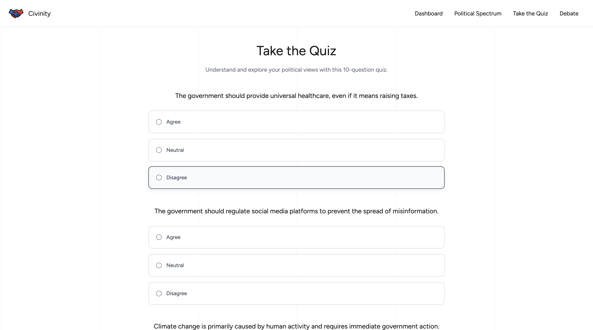
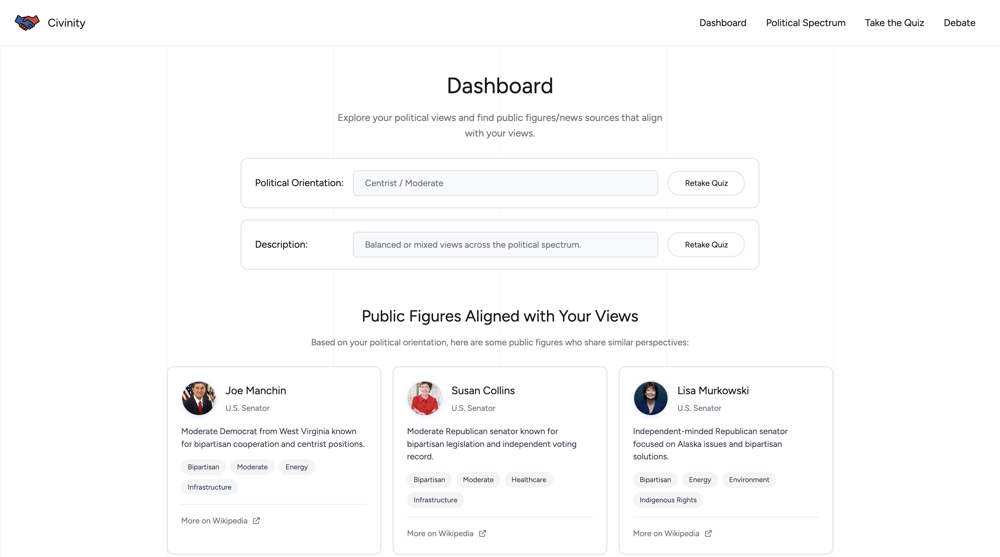
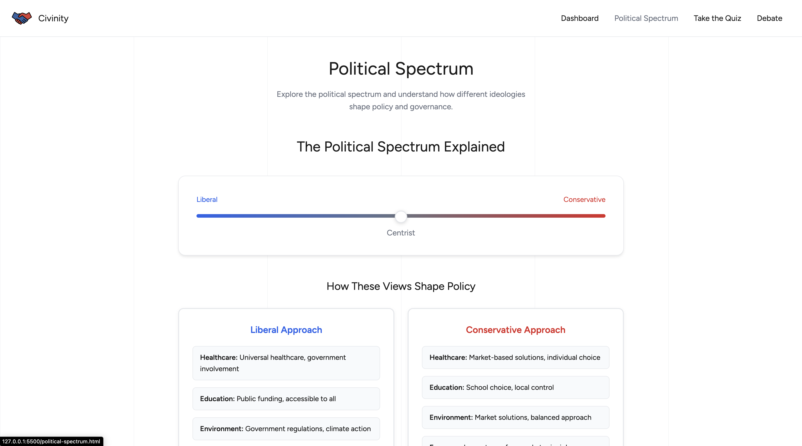
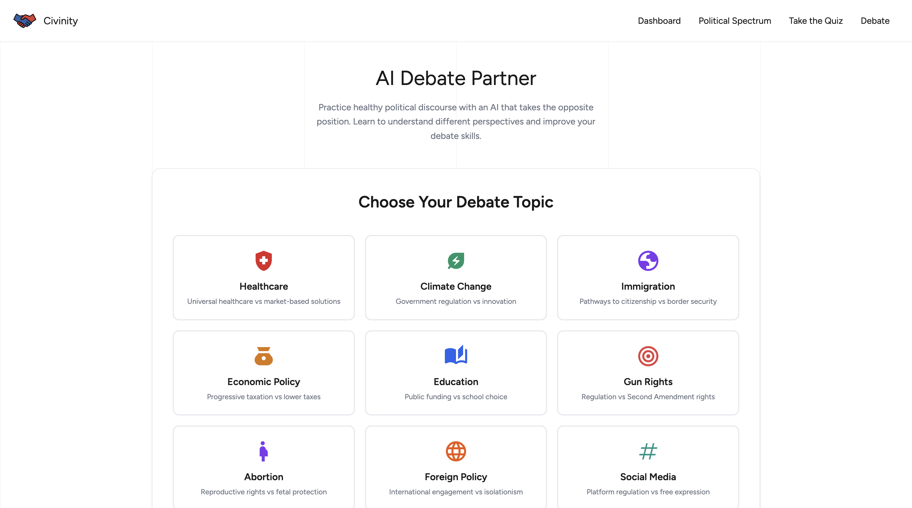

# Civinity

Civinity allows you to learn more about the political spectrum and your stance, as well as the current scope of politics.

Civinity has 4 pages: Quiz, Dashboard, Political Spectrum, and Debate

### Quiz

Take a quick 10-question quiz and learn more about your political orientation.
A shareable link is generated, and this link can be directly shared to X, reddit, or WhatsApp.

### Dashboard

In the dashboard, you can find public figures that share the same views as you, including popular figures and government officials.
Additionally, you can find news sources that align with your views.
Links are added for quick navigation.

### Political Spectrum

The political spectrum page instructs you to learn more about the political spectrum with an interactive slider and a comprehensive guide.
You can learn about the relative positions, ideological differences, historical context, common misconceptions, and key principles.

### Debate

The interactive AI debate feature enables users to explore different perspectives, thereby undermining confirmation bias.
The LLM has been specifically curated to encourage healthy debate, promoting safe and responsible practices.

### Tech Stack
- HTML, CSS, JavaScript
- Groq API for LLM usage
- Wikipedia, Britannica, IconPacks, Google Fonts